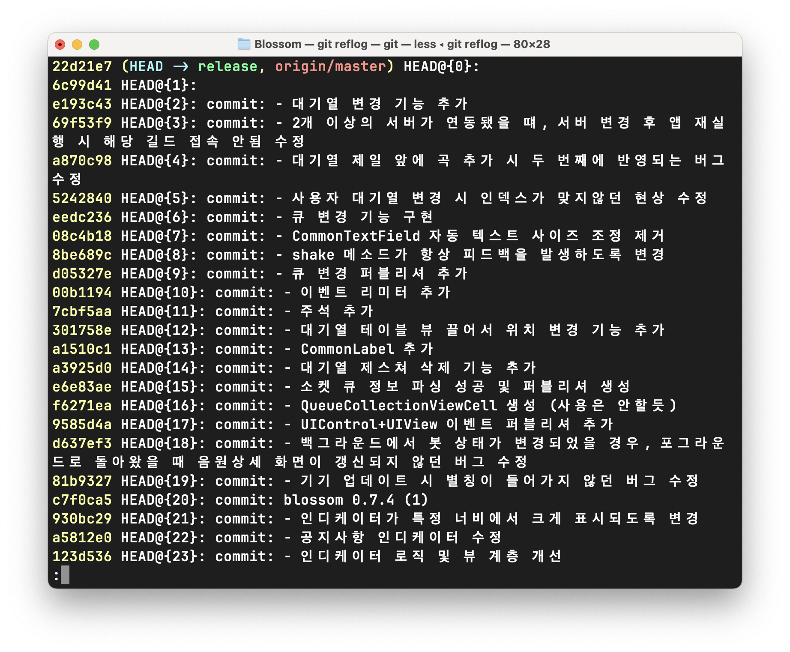

# Git Command

## git config
### git config 목록 표시 

```bash
git config --list
```

<br>

### 한글이 "\123" 형식으로 표시될 때
한글은 git 에서 **일반적이지 않은(unusual) 문자**로 인식

```bash
git config --global core.quotepath false
```

<br>

## git push
### Tag 와 함께 현재 브랜치 푸쉬
```bash
git push origin main {태그명}
# ex) git push origin main v2.0.1
```

<br>

## git fetch

remote 에서 제거되었지만 local 에 브랜치가 남아있을 때, local 브랜치를 제거하는 방법(단, 원격지와 동일한 브랜치는 유지됨)
```bash
git fetch --prune
``` 

</br>

## git remote

### 보이지 않는 원격지 브랜치 갱신
원격지에 새로 생성된 브랜치가 있고, `git pull` 를 통해 로컬에 가져오려고 했지만 `git branch` 로 확인 해 봐도 브랜치가 보이지 않았다.  
원격지의 변경사항을 확인하기전엔 **git remote** 명령을 통해 원격지의 변경사항을 먼저 가져와야한다.
```bash
git remote update
// 그리고
git pull
```

<br>

### 현재 연결된 remote 출력
```bash
git remote -v
```

<br>

### Git 원격지 두 곳에 동시에 브랜치를 push 하는 방법
github 와 gitlab 의 각각의 repository 가 있고,  
한 번의 push 명령으로 두 브랜치 모두 적용하고 싶을 때

```bash 
# 기존 원격 주소 연결 및 별칭 추가
git remote origin https://github.com/user/repository.git
# 새로운 원격 주소 추가
git remote set-url --add --push origin https://github.com/user/repository.git
# 브랜치 푸시
git push origin
```

<br>


주의사항: 
1. 맨 처음 set-url 옵션으로 url 을 지정할 경우, 기존에 있던 URL 이 대체되어버린다, 그럴 떄는 기존 url 을 한번더 set-url 로 지정하면 된다.
2. `Xcode` 상에서 `push` 할 경우 특정 저장소에만 푸시되는걸로 보이는데, 터미널 상에서 `git push origin` 명령을 사용하면 동시에 푸시된다.


<br>

## git rm

### 원격 저장소와 로컬 저장소에 있는 파일을 삭제
```bash
git rm [File Name]
```

<br>

### 로컬 저장소에 있는 파일은 그대로 두고, 원격 저장소에 있는 파일을 삭제
```bash
git rm --cached [File Name]
# App 디렉토리 아래의 AppDelegate.swift 파일 삭제 예시
# ex) git rm --cached App/AppDelegate.swift
# App 디렉토리 아래의 모든 파일 삭제
# ex) git rm --cached -r App/
```

<br>

### .DS_Store 파일이 깃에 포함되는 문제
1. 하위 모든 디렉토리의 .DS_Store 파일 일괄 제거
```bash
find . -name .DS_Store -print0 | xargs -0 git rm -f --ignore-unmatch
```

2. 이미 원격지에 커밋되었다면 제거 후 다시 커밋
```bash
git rm -r --cached .    // 기존에 작성된 내역을 제거 (실제 파일은 제거되지 않으니 안심)
git add .
git commit -m "applying .gitignore"
```

3. .gitignore 파일 생성 후 아래 내용 추가
```vim
.DS_Store
._.DS_Store
**/.DS_Store
**/._.DS_Store
```

<br>

## Git Conflict
깃 충돌이 일어났을 때, 터미널 상에서 해결하기 위한 유용한 커맨드를 소개한다.

**git reflog**  
  
*Gif Reflog*  

> 최근 커밋부터 커밋 번호를 출력한다.

<br>

## Git Log

### 특정 파일의 변경 로그 확인

### 문자열과 일치하는 커밋 확인
```bash
git log -S function_name
# ex) git log -S AppDelegate
```

<br>

### 문자열과 일치하는 커밋의 내용과 함께 확인
```bash
git log -S function_name -p
# ex) git log -S AppDelegate -p
```


## git ignore
### Configs 폴더를 유지하면서, 아래 폴더와 파일은 커밋하지 않는 방법

```bash
# Configs 디렉토리 하위 모든 파일 무시
Configs/* 
# Configs 디렉토리만 추적
!Configs/

# 빈 폴더는 git 에서 추적하지 않음, .gitkeep 파일 생성 후 Configs 디렉토리 추적
touch Configs/.gitkeep
!Configs/.gitkeep (.gitkeep 파일은 추적함)
```
