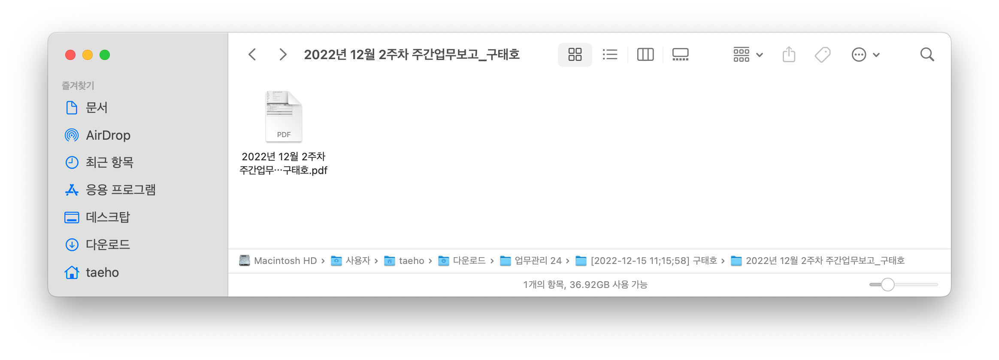

## 파일 시스템

### 특정 확장자 파일 일괄 복사 or 이동

그룹웨어에 매 주 업로드해왔던 업무일지를 pdf 형식으로 받을 필요가 있었다.

5개씩 묶음으로 내려받기가 가능해서 (21년 11월 ~ 23년 2월) 사이의 주간 업무일지 묶음이 13개 디렉토리로 내려받아졌다.


문제는 마트료시카처럼 각 디렉토리아래에 또 다른 디렉토리, 그 아래에 또 다른 디렉토리 아래에 pdf 파일이 있는 상황이였다



ex) 다운로드 > 업무관리 5 > 2023-01-20 구태호 > 2023년 1월 3주차 주간업무보고*구태호 > 2023년 1월 3주차 주간업무보고*구태호.pdf

</br>

GUI 로 손수 전부 파일을 찾아 이동하면 시간이 굉장히 오래 걸리지만
CLI 명령어로는 순식간에 끝낼 수 있다.

</br>

`find` 명령어와 `cp` 명령을 조합하면 일괄 복사가 가능하고,  
`find` 명령어와 `mv` 명령을 조합하면 일괄 이동이 가능하다.

</br>

먼저 옮겨질 pdf 파일들을 출력만 해보고 싶을 경우 아래 명령을 작성하면 된다.

```bash
find 검색할경로 -type f -iname "*.pdf"
# ex) find ~/Downloads -type f -iname "*.pdf"
```


</br>

옮겨질 파일에 문제가 없다면 복사를 해보자

만약 복사전 디렉토리가 없을경우 미리 생성해두자

```bash
mkdir ~/Documents/work
```

</br>

**다운로드 디렉토리 아래에 있는 .pdf 확장자 파일을 전부 검색해서, 문서 디렉토리 아래의 work 디렉토리로 복사하는 방법**

```bash
find 검색할경로 -type f -iname "*.pdf" -exec cp "{}" 복사될경로 \;
# ex) find ~/Downloads -type f -iname "*.pdf" -exec cp "{}" ~/Documents/work \;
```

홈 디렉토리 아래 문서 디렉토리에 재귀적으로 검색된 pdf 파일이 들어있는 것을 확인할 수 있다

</br>


</br>

만약 복사가아니라 이동시키고 싶을 경우 `cp` 를 `mv` 로 바꿔주면 된다

```bash
find 검색할경로 -type f -iname "*.pdf" -exec mv "{}" 복사될경로 \;
# ex) find ~/Downloads -type f -iname "*.pdf" -exec mv "{}" ~/Documents/work \;
```

</br>
</br>

## 연결

### SSH 키 생성 (비밀번호 없이 연결)

참고: https://pyromaniac.me/24

**ssh-keygen** 명령을 통해 공개키와 비밀키 쌍을 생성할 수 있다

`-t`: 키 인증 알고리즘 (rsa, dsa, ecdsa)  
`-b`: 키 비트 수  
`-f`: 키 파일 명 설정

생성 후 `.pub` 으로 끝나는 확장자가 공개키(Public Key) 나머지가 개인키(Private Key) 이다.

```zsh
// RSA 알고리즘을 사용하며, 길이가 4096 비트고, 이름이 myKey 인 SSH 키를 생성한다.
ssh-keygen -t rsa -b 4096 -f mykey
```

</br>

### SSH 키 전송

> 개인 키는 클라이언트가, 공개 키는 서버가 가지고 있어야하므로, 생성된 키를 서버로 전달해야한다.
> **ssh-copy-id** 명령을 통해 키를 전달할 수 있다.
>
> 전달된 키는 홈 디렉토리의 `.ssh/authorized_keys` 파일(root는 `etc/.ssh`)에서 찾아볼 수 있다.

```zsh
ssh-copy-id -i <공개키 경로> <서버 IP>

# ex) ssh-copy-id -i ~/.ssh/id_ed25519_mymac.pub -p 22 taeho@muangs.kr
```

</br>

### SSH 접속

ssh `사용자 명`@`원격지 IP`

</br>
</br>

## 시스템

### 시스템 종료

```zsh
shutdown -h now
```

### 시스팀 재시작

```zsh
shutdown -r now
```

### 블루투스 데몬 종료

블루투스 주변기기와 통신 딜레이가 발생하며,
주변기기 재 연결을 시도했음에도 딜레이가 계속 발생할 때

```zsh
sudo pkill bluetoothd
```

### Dock, Widget 프로세스 종료

```sh
killall Dock & killall NotificationCenter
```

### 프로세스 정보

```zsh
// 시스템 정보를 포함한 프로세스 목록 출력
top
// 데몬 상태 출력
systemctl status
```

### 시스템 하드웨어 정보(lshw 설치필요)

```zsh
// 상세 정보 출력
lshw
// 간소화된 정보 출력
lshw -short
// CPU 온도
vcgencmd measure_temp
// 메모리 출력
free
// 디스크 출력
df -h
```

### 현재 운영체제 확인

```zsh
lsb_release -a
```

</br>
</br>

## 패키지 관리자 (Debian)

### 저장소 관리

Ubuntu 및 Debian 기반의 소프트웨어 리포지토리는 **/etc/apt/sources.list/** 디렉토리 아래의 별도의 파일로 정의된다

파일을 직접 수정할 수도 있지만, apt-add-repository 명령을 통해 레포지토리를 추가, 수정 및 삭제할 수 있다.
(단, **software-properties-common** 패키지 설치 필요)

```zsh
// 저장소 목록 출력
add-apt-repository -L
// 저장소 추가
add-apt-repository [options] <저장소 명>
// 저장소 제거
add-apt-repository --remove <저장소 명>
```

### 저장소 업데이트

```zsh
apt update
```

### 패키지(앱) 업데이트

```zsh
apt upgrade
```

### 설치된 패키지 리스트 출력

```zsh
apt list
```

### 설치된 업그레이드 가능한 패키지 리스트 출력

```zsh
apt list --upgradable
```

### 저장소에서 설치가능한 패키지 검색

```zsh
apt search <패키지명>
```

</br>
</br>
