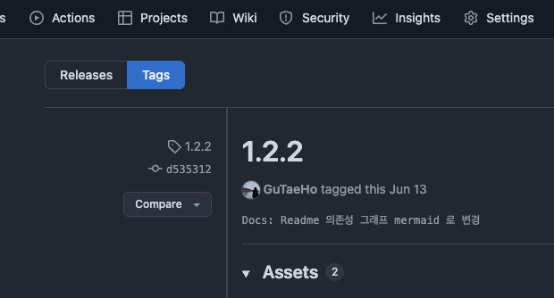

# Tuist Command

`tuist` 에서 자주 사용되는 명령어 정리

</br>

## tuist edit

프로젝트를 편집한다

</br>

`tuist` 는 더이상 project 를 GUI 에서 수정할 수 없고, 수정하더라도, `tuist generate` 시 변경사항이 초기화 된다.

불편하다고 느낄 수 있지만, 협업 시 코드를 통할 일관적인 프로젝트 설정이 가능하기 때문에 대규모 프로젝트에서 선호된다.

</br>

```bash
# 프로젝트 디렉토리에서 실행
tuist edit

...

# 편집완료 후
tuist generate
```

</br>

## tuist install

### 종속성 설치

`Package.swift 파일에 명세된 url 의 패키지를 내려받는다.

최초 설치라면 명세된 버전 중 가장 높은 버전을, 이미 설치가 되었다면  
Package.resolved 에서 캐싱된 버전을 내려받는다.

> 코코아 팟의 `pod install` 이 podfile.lock 에 명세된 종속성을 내려받는 것과 동일하다.

</br>

```bash
tuist install
```

</br>

### 종속성 업데이트

새로운 종속성을 내려받는다.

> `pod update` 와 동일하게 캐싱된 버전을 지우고, 완전히 새로운 종속성을 설치한다.

```base
tuist install --update
```

</br>

### 특정 패키지만 버전 수정

개인용 패키지 및 사내용 패키지를 git 에 올려 테스트를 하거나 기능 구현을 할 경우, 패키지의 잦은 수정 및 버전 변경이 있을 수 있다.

하지만 tuist 는 `Package.swift` 의 명세에 맞게 모든 패키지를 수정하기 때문에, 특정 패키지만 버전을 변경하는게 불가능하다.

이럴 때 특정 패키지만 버전을 변경할 수 있는 방법이 있다.

</br>

1. Tuist 프로젝트 루트 디렉토리로 이동
2. Tuist 디렉토리 아래에 있는 `Package.resolved` 파일 열기
3. 수정하고 싶은 패키지의 버전(`version`)과 리비전(`revision`) 정보 변경
4. `tuist install` & `tuist generate` 실행

</br>

```bash
# Package.ressolved

# soybean 패키지의 버전 변경 시
{
    "identity" : "soybean",
    "kind" : "remoteSourceControl",
    "location" : "https://github.com/GuTaeHo/SoyBean.git",
    "state" : {
        "revision" : "0938c97daf6e25c66c07736d9fc6e7d2b6ca4c3b", # "0de76c77b907d160bb16bccc618eefc65f1f276d"
        "version" : "1.0.0" # "1.2.7"
    }
},
```

</br>

#### + Version & Revision 확인

`version` 과 `revision` 정보는 패키지 깃 레포지토리에 들어가  
`Tags` 를 누른 뒤, 원하는 버전을 클릭하면 확인할 수 있다.

</br>



</br>

### tuist 접근 권한 문제

`mise` 를 통해 `tuist` 를 설치할 때, sudo 권한으로 설치한경우,  
`tuist` 에서 생성한 프로젝트가 `root` 권한에 종속되어 사용자 권한으로 파일 수정이 불가능한 경우가 발생한다

</br>

#### 해결방법

프로젝트 폴더 및 하위 파일 권한을 사용자 권한으로 변경하면 해결된다

```sh
# 프로젝트 폴더 및 하위 폴더, 파일들의 권한을 사용자 권한으로 변경한다
sudo chown -R $USER <Project>
# sudo chown -R $USER Zziik
```
