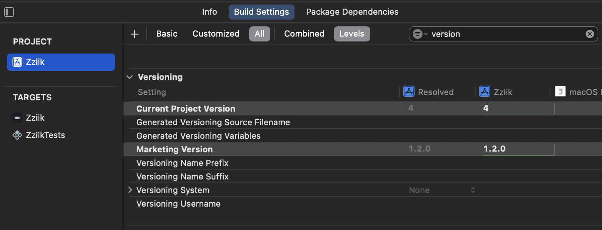
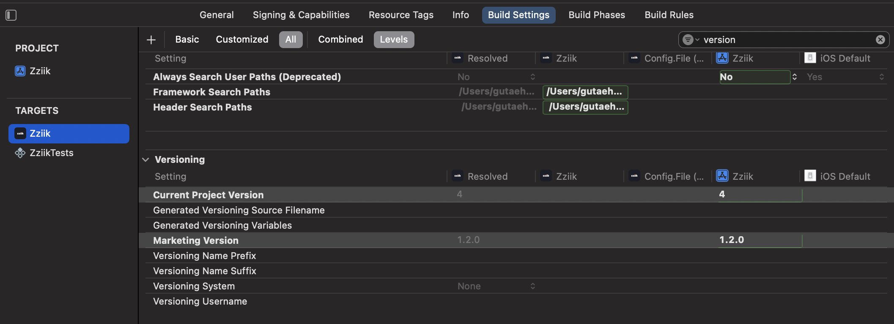
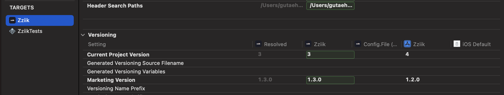

# Xcode Enhanced

Xcode 를 사용하면서 만난 문제점 및 해결방법 & 조금 더 생산적이며 효율적으로 사용할 수 있는 방법 정리

</br>

## 단축키

```swift
// 현재 화면 새로운 탭으로 열기
Command + t

// 현재 파일 네비게이터에 표시
Command + Shift + j

// 상단 바 고정
Alt + Command + t
```

</br>
</br>

## 빌드

### 빌드 시간 표시

```bash
defaults write com.apple.dt.Xcode ShowBuildOperationDuration -bool YES
rm -rf ~/Library/Developer/Xcode/DerivedData
```

위 명령 수행 후, Run Device 선택 창에 빌드 시간 표시됨

<br>

### 다중 타겟 프로젝트의 Build Settings 버전 관리 방법

여러 플랫폼을 지원하거나, `App Extension` 을 구현한 프로젝트일 경우 타겟이 2개 이상일텐데,
`App Extension` 은 타겟 앱과 버전이 동일해야하며 (컴파일 경고), 
플랫폼간 버전을 통일해야하는 경우 매번 모든 타겟의 버전을 변경해야한다.

Xcode 의 `Build Settings` 는 프로젝트 단위에 설정된 값을 타겟이 참조할 수 있는데, 
이를 활용하면 프로젝트 단위 값만 변경하는 것으로 손쉽게 변경할 수 있다.

</br>

**프로젝트 단위 설정**

xcode > project > build settings 로 이동 후, 검색창에 `version` 을 입력하면 아래와 같이 표시된다. 



`Current Project Version` 은 빌드 버전을 의미하고,
`Marketing Version` 은 앱스토어 상에 표시되는 앱 버전을 의미한다.

빌드 버전과 앱 버전을 원하는 대로 설정한 다음 타겟 설정으로 이동 한다

</br>

**타겟 단위 설정**

좌측 타겟을 누르면 타겟 레벨의 값이 표시된다



위 사진은 타겟에 별도로 할당된 값이 없는 상태다. 이 경우 컴파일 시 프로젝트 단위의 값을 참조한다.



위 사진은 타겟에 할당된 값이 있어, 해당 타겟이 빌드될 경우 프로젝트의 값은 무시된다.

할당된 값을 클릭한 뒤, 삭제 후 타겟을 다시 빌드하면 프로젝트 단위의 값을 참조한다.

</br>

**유의사항**
Build Settings 의 값을 공백으로 넣더라도 값이 `""` 으로 할당되는 경우가 있다.
이 때는 수정될 필드를 한번 누르고 `back space` 나 `delete` 를 누르면된다.
(xcode16 기준) 값이 할당되었을 경우, 둥근 초록색 박스가 표시되지만, 
값이 없을 경우 배경과 동일한 색상으로 표시된다.

</br>
</br>

## 디버깅

### 디버그 연결중단 개선


1. 홈 디렉토리에 .lldbinit 파일을 생성한다.

```bash
vi ~/.lldbinit
```

2. 다음 라인을 파일에 추가한다.

```bash
settings set plugin.process.gdb-remote.packet-timeout 300
```

3. Xcode 를 재실행한다.

<br>

### 디버깅 속도 개선

1. 홈 디렉토리에 .lldbinit 파일을 생성한다.

```bash
vi ~/.lldbinit
```

2. 다음 라인을 파일에 추가한다.  

```bash
settings set target.experimental.swift-enable-cxx-interop false
```

3. Xcode 를 재실행한다.

</br>

## Git

### 머지 충돌 1

현재 커밋된 작업내용과 다른 브랜치의 작업내용이 충돌됐지만,  
경로가 변경되거나 파일이 삭제되어 Xcode 상에서 확인이 불가능하지만 머지도 불가능할 때

</br>

1. Xcode 병합 편집기 상태를 그대로 둔 상태로 Visual Studio Code 실행
2. 프로젝트를 열고 좌측 소스 제어 탭 열기
3. 취소선으로 그어진 파일 "+" 버튼 클릭
4. `현재 버전 유지` 클릭 후 커밋

</br>

### Git ssh 연결

1. 키 생성 명령어 입력

```bash
ssh-keygen -t ecdsa -C "your_email@example.com" -m PEM
```

  

*keygen 의 타입 옵션을 주지 않으면 SHA-1 으로 생성된다.  
Xcode 는 SHA-1 으로 암호화된 키를 허용하지 않기 때문에 ecdsa 방식으로 생성해야한다*

*PEM 옵션은 pull, push 를 수행할 때 마다 인증을 해줘야하는 번거로움을 제거한다*

2. ssh 키 생성  
~/.ssh 경로확인 및 passphrase 를 엔터로 스킵한다.
  

3. 공개키(.pub) 깃 허브에 저장  
프로필 > Settings > SSH and GPG keys > New SSH key  
  

4. Xcode Git 설정  
Xcode > Settings > Accounts > Source Control Accounts  
  

5. 원격지 변경
http 로 clone 을 받은 프로젝트라면 ssh 로 변경해줘야한다.  

```bash
# 원격지 확인
git remote -v

# 원격지 설정
git remote set-url origin git@github.com:<RepoName>/<RepoName>.git
```

</br>
</br>

## Xcode Simulator

### 현재 설치된 모든 시뮬레이터 목록

```bash
xcrun simctl list devices
```

</br>

### 비활성화 상태의 모든 시뮬레이터 제거

```bash
xcrun simctl delete unavailable
```

</br>

### Playground 파일 제거

`/Users/gutaeho/Library/Developer` 아래 경로의 **XCPGDevices** 디렉토리 제거

</br>
</br>

## Xcode Previews

`Preview` 는 앱을 실행하지 않고 실시간으로 코드의 변경사항을 추적해 표시해주는 강력한 기능을 제공하지만

종종 ~~자주~~ Preview 가 먹통이 되는 경우가 있다

빌드 및 실행은 정상적으로 되지만, **Preview 만 동작**하지 않을 때 해결하는 방법을 소개한다.

</br>

### Cannot Preview in this file (패키지, 프레임워크 로딩 문제)
KakaoSDK 나 Firebase 등 objc 기반으로 작성된 프레임워크를 사용중인 프로젝트에서 주로 발견되는 것으로 보인다.

**로그**

`CouldNotLoadInputStaticArchiveFile` 문구가 포함되어있다.

**해결방법**

`Xcode` -> `Editor` -> `Canvas` -> `Use Legacy Previews Execution` 체크

</br>

### Failed to build 
프로젝트에서 정의된 메소드와 패키지(프레임워크)의 메소드 중복될 경우 발생한다

앱을 빌드할 경우, 앱에 정의된 메소드가 우선순위가 높아서 문제가 없지만, 프리뷰에서는 모호하다는 에러가 표시된다.

**앱**
```swift
// App
extension Font {
    static func custom(_ type: FontType, size: CGFloat) -> Font {
        return .custom(type.rawValue, fixedSize: size)
    }
}
```

**패키지(프레임워크)**

```swift
// Framework
extension Font {
    static func custom(_ type: FontType, size: CGFloat) -> Font {
        return .custom(type.rawValue, fixedSize: size)
    }
}
```

**로그**

`Compiling failed: ambiguous use of 'font'` 가 포함되어있다

**해결방법**

패키지를 제거하거나, 패키지 의존도가 강할경우, 프로젝트의 메소드를 변경한다.


</br>

### iOS 17 미만 지원 타겟에서 Preview 를 사용하는 방법

> Xcode 15 부터 지원하는 Preview 기능은 iOS 17 이상부터 지원되는듯하다.  
> 기존의 플랫폼을 지원해야하는 레거시 프로젝트에서는 `@available` 어노테이션을 사용하면 미리보기가 효과적으로 동작한다.

```swift
@available(iOS 17, *)
#Preview("Preview 테스트") {
    // TODO: 미리보기 뷰
}
```

</br>

### Preview 재설정(삭제)

```bash
xcrun simctl --set previews delete all
```

</br>

`/Users/gutaeho/Library/Developer/Xcode/UserData/Previews/Simulator Devices` 아래 경로의 시뮬레이터를 모두 제거

</br>
</br>

## Swift Package

### SPM 패키지 캐시 완전히 날려버리는 방법

```bash
rm -rf ~/Library/Developer/Xcode/DerivedData
rm -rf ~/Library/Caches/org.swift.swiftpm
rm -rf ~/Library/org.swift.swiftpm
rm -rf ~/.swiftpm
```

</br>

### Package 추가 시 에러가 발생할 때
>
> Xcode > File > Add Package Dependencies 후 설치 시 아래 에러 발생  
> 에러 내용: skipping cache due to an error the repository could not be found

</br>

**해결 방법 1)**

- DerivedData 를 날리고 재시도한다.

**해결 방법 2)**

- Xcode 를 완전히 종료한 다음 아래 명령어를 실행한다

    ```bash
    defaults write com.apple.dt.Xcode IDEPackageSupportUseBuiltinSCM YES
    ```

</br>

### 높은 버전 Package 가 내려받아지지 않을 때(테스트 환경: Xcode 16.2)
>
> 패키지의 높은 버전이 Git 에 올라와 있지만,  
> 프로젝트에서 이전 버전의 버전만 보고있음

ex) git remote 에 `1.0.5` 태그가 올라왔지만, 아직 프로젝트는 `1.0.4` 를 보고있음

</br>

**해결 방법**

1. **Xcode 끄고 다시 실행**
2. Xcode > File > Packages > Update to Last Package Versions 실행

</br>
</br>

## Apple Watch

> **들어가기 전..**   
> 애플은 워치 앱 개발 환경을 전혀 개선하지 않고 있다.  
> Xcode 로 워치를 처음 연결하는 과정과 개발 도중 지속적인 연결 해제 및 재연결 실패  
> 만약 워치 앱을 개발해야 한다면, 실 기기와 통신 및 디버깅은 못한다고 가정하고 개발할 것  
> **https://developer.apple.com/forums/thread/755796?page=2** (수 많은 사람들이 문제 제기 중)

Apple Watch 앱 개발 시 연결 단계에서 엄청 고생하는듯 하다...

~~(환경 세팅만 하루 썼다...)~~

아래 내용은 `Apple Developer Forums` 에서 확인한 정보 중 정상동작하는 부분만 정리해두었다.

[포럼](#참고)은 아래 참고를 확인


### 개발 전 선행 작업
1. 아이폰, 맥, 워치 모두 같은 네트워크에 있어야함  
	2.4Ghz, 5Ghz 대역대는 달라도 문제 없는 듯  
	ex) 맥 = 5.0Ghz, 워치 = 2.4Ghz
	
	워치는 2.4Ghz 대역밖에 못 잡음
	
	라우터 아래 네트워크 환경에서 개발 권장,  
	환경 상 어쩔 수 없이 제 3의 아이폰 핫스팟으로 연결해보려했으나 실패...

2. Xcode 의 워치 시뮬레이터 설치 (개발하려면 무조건 설치하라고 표시해줌)

3. 워치의 shared cache symbols 를 가져오기
	(symbols 를 가져오기 전 워치 시뮬레이터가 선행 설치되어 있어야함)
	설치되어 있지 않다면 Device Manager 에서 연결되지 않았다고 지속적으로 표시

- shared cache symbols 은 워치가 잠금이 풀려있지 않아도 네트워크에 연결되어있고,  
	shared cache symbols 을 가져올 수 있다.  
    이 과정이 상당히 오래(약 10 ~ 15분, 총 2.2GB, 2MB/s) 걸린다. **기다리자**

- 워치용 앱을 개발할 때는 아이폰을 맥과 유선 연결하는 것을 권장(필수적일 수도 있음)

</br>

### Xcode 에서 아이폰만 잡히고, 워치가 보이지 않을 때 (Xcode 16.3 기준 정상동작 확인)

**반드시 모든 순서를 따라야 정상동작**

1. Xcode 에서 Watch 와 iPhone 페어링 해제
2. Xcode 종료 및 iPhone 연결 해제
3. 두 기기에서 신뢰할 수 있는 컴퓨터 제거
4. 개발자 모드 비활성화
5. 두 기기 모두 재시동
6. Finder 를 사용해 iPhone 연결 및 컴퓨터 신뢰
7. Xcode 를 열고 iPhone 페어링(다시 신뢰)
8. Watch 와 iPhone 에서 개발자 모드 활성화
9. 작동
	
</br>

### 지속적으로 연결 시도... 전송 에러 발생 시
Xcode 를 완전히 끈다음, 맥의 WIFI 끈 후 재접속,  
워치가 2.4Ghz 대역대의 네트워크에 잘 연결되어있는지 확인 후 다시 Xcode 켜서 빌드

</br>

## 참고  

[lldb 가 왜 이렇게 느리죠?](https://stackoverflow.com/questions/75850606/why-is-lldb-so-painfully-slow)

[디버거 연결 해제](https://forums.developer.apple.com/forums/thread/681037)

[git push 를 할 때 마다 인증 요청 문제](https://stackoverflow.com/questions/53879986/xcode-10-1-push-to-github-using-ssh-key)

[Apple Watch cannot reconnect](https://developer.apple.com/forums/thread/734694?page=3)
