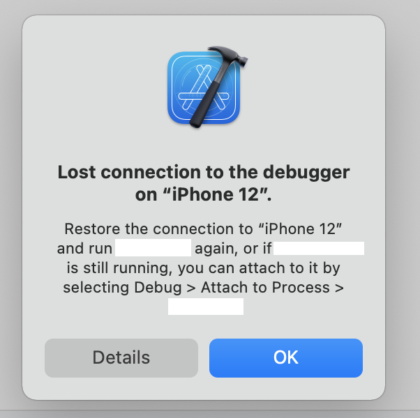
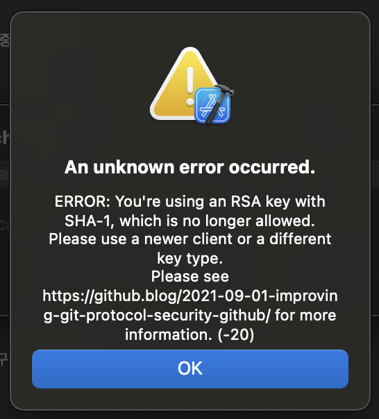
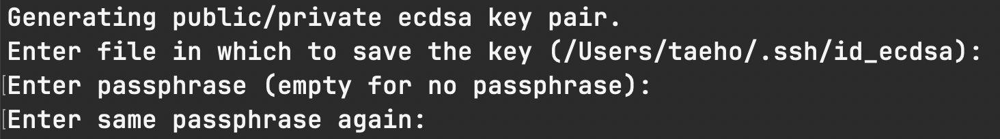
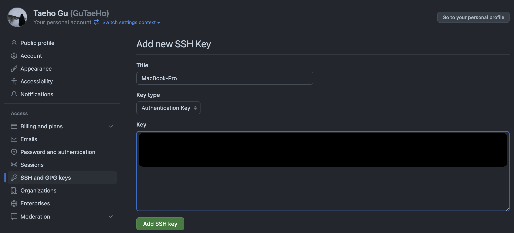
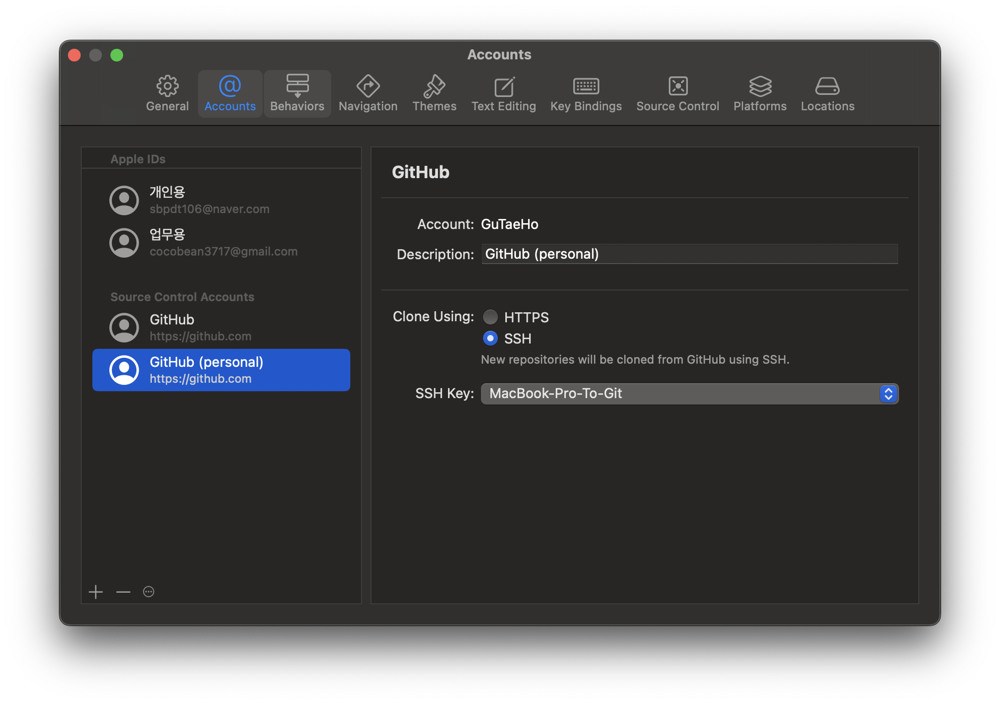

# Xcode Enhanced

Xcode 를 조금 더 생산적이며 효율적으로 사용할 수 있는 방법 정리

</br>

## 단축키

###

```swift
// 현재 화면 새로운 탭으로 열기
Command + t

// 현재 파일 네비게이터에 표시
Command + Shift + j

// 상단 바 고정
Alt + Command + t
```

</br>

## 빌드

### 빌드 시간 표시

```bash
defaults write com.apple.dt.Xcode ShowBuildOperationDuration -bool YES
rm -rf ~/Library/Developer/Xcode/DerivedData
```

위 명령 수행 후, Run Device 선택 창에 빌드 시간 표시됨

</br>

## 디버깅

### 디버그 연결중단 개선



1. 홈 디렉토리에 .lldbinit 파일을 생성한다.

```bash
vi ~/.lldbinit
```

2. 다음 라인을 파일에 추가한다.

```bash
settings set plugin.process.gdb-remote.packet-timeout 300
```

3. Xcode 를 재실행한다.

<br>

### 디버깅 속도 개선

1. 홈 디렉토리에 .lldbinit 파일을 생성한다.

```bash
vi ~/.lldbinit
```

2. 다음 라인을 파일에 추가한다.  

```bash
settings set target.experimental.swift-enable-cxx-interop false
```

3. Xcode 를 재실행한다.

</br>

## Git

### 머지 충돌 1
>
> 현재 커밋된 작업내용과 다른 브랜치의 작업내용이 충돌됐지만,  
경로가 변경되거나 파일이 삭제되어 Xcode 상에서 확인이 불가능하지만 머지도 불가능할 때

</br>

1. Xcode 병합 편집기 상태를 그대로 둔 상태로 Visual Studio Code 실행
2. 프로젝트를 열고 좌측 소스 제어 탭 열기
3. 취소선으로 그어진 파일 "+" 버튼 클릭
4. `현재 버전 유지` 클릭 후 커밋

### Git ssh 연결

1. 키 생성 명령어 입력

```bash
ssh-keygen -t ecdsa -C "your_email@example.com" -m PEM
```

  

*keygen 의 타입 옵션을 주지 않으면 SHA-1 으로 생성된다.  
Xcode 는 SHA-1 으로 암호화된 키를 허용하지 않기 때문에 ecdsa 방식으로 생성해야한다*

*PEM 옵션은 pull, push 를 수행할 때 마다 인증을 해줘야하는 번거로움을 제거한다*

2. ssh 키 생성  
~/.ssh 경로확인 및 passphrase 를 엔터로 스킵한다.
  

3. 공개키(.pub) 깃 허브에 저장  
프로필 > Settings > SSH and GPG keys > New SSH key  
  

4. Xcode Git 설정  
Xcode > Settings > Accounts > Source Control Accounts  
  

5. 원격지 변경
http 로 clone 을 받은 프로젝트라면 ssh 로 변경해줘야한다.  

```bash
# 원격지 확인
git remote -v

# 원격지 설정
git remote set-url origin git@github.com:<RepoName>/<RepoName>.git
```

</br>

## Xcode Simulator & Previews

### Preview 시뮬레이터 디바이스 삭제

```bash
xcrun simctl --set previews delete all
```

</br>

`/Users/gutaeho/Library/Developer/Xcode/UserData/Previews/Simulator Devices` 아래 경로의 시뮬레이터를 모두 제거

</br>

### 현재 설치된 모든 시뮬레이터 목록

```bash
xcrun simctl list devices
```

</br>

### 비활성화 상태의 모든 시뮬레이터 제거

```bash
xcrun simctl delete unavailable
```

</br>

### Playground 파일 제거

`/Users/gutaeho/Library/Developer` 아래 경로의 **XCPGDevices** 디렉토리 제거

</br>

## Swift Package

### SPM 패키지 캐시 완전히 날려버리는 방법

```bash
rm -rf ~/Library/Developer/Xcode/DerivedData
rm -rf ~/Library/Caches/org.swift.swiftpm
rm -rf ~/Library/org.swift.swiftpm
rm -rf ~/.swiftpm
```

</br>

### Package 추가 시 에러가 발생할 때
>
> Xcode > File > Add Package Dependencies 후 설치 시 아래 에러 발생  
> 에러 내용: skipping cache due to an error the repository could not be found

</br>

**해결 방법 1)**

- DerivedData 를 날리고 재시도한다.

**해결 방법 2)**

- Xcode 를 완전히 종료한 다음 아래 명령어를 실행한다

    ```bash
    defaults write com.apple.dt.Xcode IDEPackageSupportUseBuiltinSCM YES
    ```

</br>

### 높은 버전 Package 가 내려받아지지 않을 때(테스트 환경: Xcode 16.2)
>
> 패키지의 높은 버전이 Git 에 올라와 있지만,  
> 프로젝트에서 이전 버전의 버전만 보고있음

ex) git remote 에 `1.0.5` 태그가 올라왔지만, 아직 프로젝트는 `1.0.4` 를 보고있음

</br>

**해결 방법**

1. **Xcode 끄고 다시 실행**
2. Xcode > File > Packages > Update to Last Package Versions 실행

</br>

### 참고  

[lldb 가 왜 이렇게 느리죠?](https://stackoverflow.com/questions/75850606/why-is-lldb-so-painfully-slow)

[디버거 연결 해제](https://forums.developer.apple.com/forums/thread/681037)

[git push 를 할 때 마다 인증 요청 문제](https://stackoverflow.com/questions/53879986/xcode-10-1-push-to-github-using-ssh-key)
