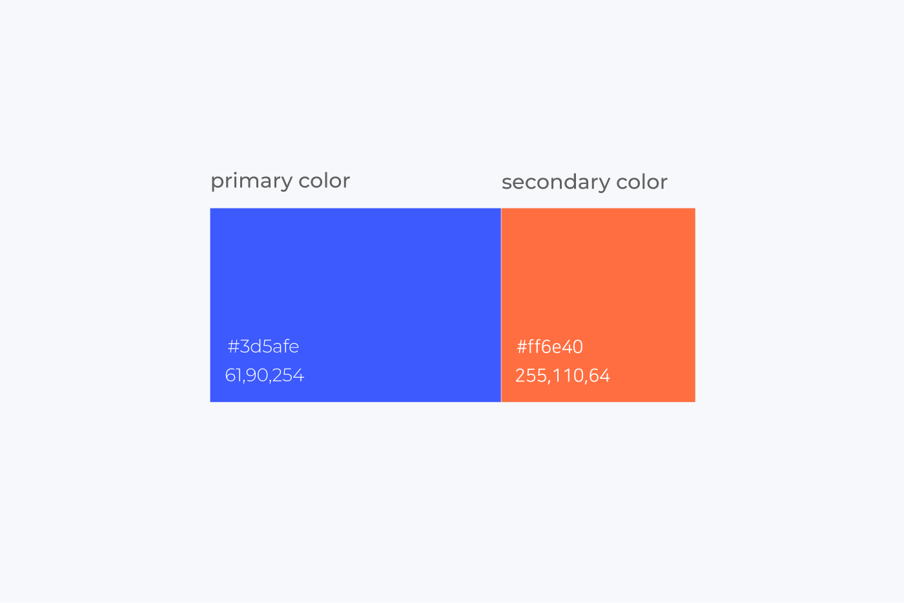
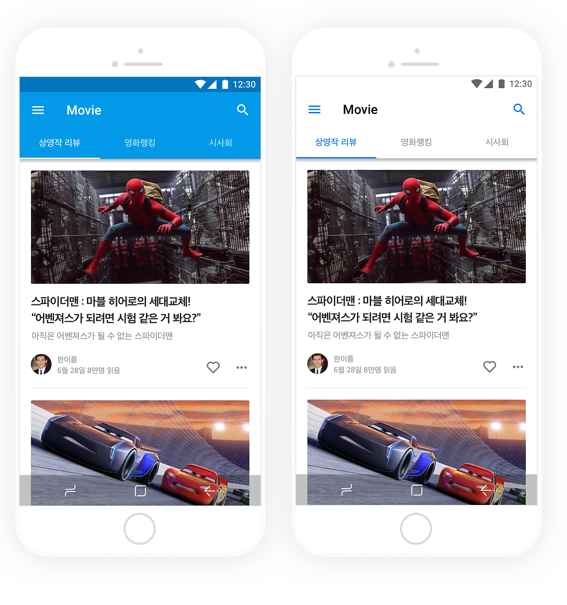
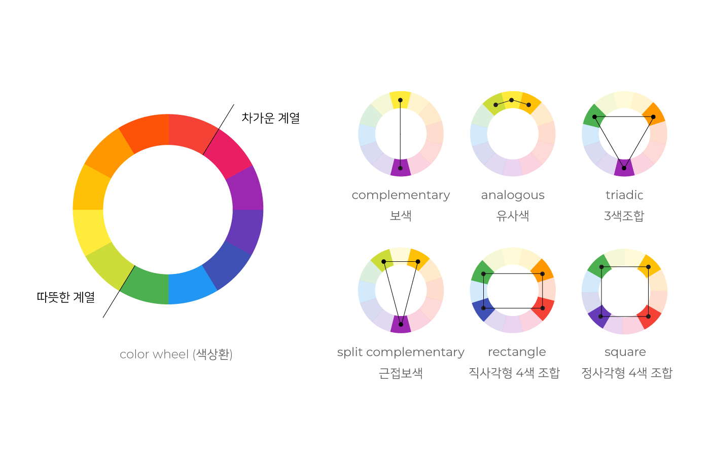
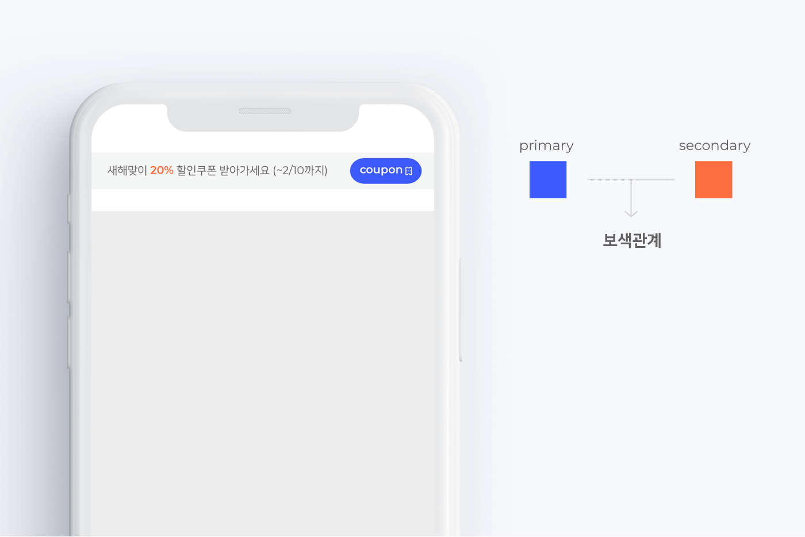
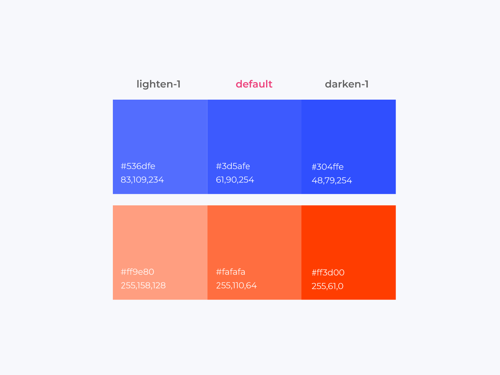

# Color System
사용자가 제품을 사용하면서 높은 사용자 경험(콘텐츠에 온전히 집중이 가능하도록 만듦)을 얻을 수 있도록, 
상황에 따른 일관적인 색상을 표시하는 것은 중요하다.
또한 제품을 만드는 개발자와 디자이너간 원활한 소통 및 협업을 위해서도 이러한 규칙이 필요하다.

<br>

### 브랜드 컬러(Brand Color)
<center></center>

*브랜드 컬러*  

브랜드를 나타내는 **고유한 색상**으로 브랜드 전체의 통일감을 부여하며, 사용자에게 같은 메시지를 전달할 때 효과적이다.
예시로 애플의 흰색, 네이버의 초록색, 카카오톡의 노란색을 예로 들 수 있겠다.

브랜드 컬러는 2가지 색상으로 구성된다.
소수의 컬러를 사용함으로써 브랜드 색상을 **각인**시키고, 일관적인 사용자 경험을 전달할 수 있다.

너무 단조롭게 느껴질 경우, 채도와 명도를 더할 수 있다.

**Primary Color**  
<center></center>
가장 일반적으로 사용되는 색상이다.
주로 네비게이션 바, 텍스트 타이틀 등의 색상에 사용된다.  

**Secondary Color (ActionColor)**  
`PrimaryColor` 와 대비되는 색을 주로 사용한다.
주로 버튼, 스위치, 현재 위치, 프로그레스 바 등에서 사용된다.

`PrimaryColor` 와 `SecondaryColor` 는 **보색**을 기본으로 한다.

<br>

### 색채의 배합(Color Scheme)
<center></center>
*컬러 스킴*  
`PrimaryColor` 와 `SecondaryColor` 를 정할 때 색상간의 조합도 매우 중요하다.
색상의 배합을 결정할 때 어려움을 느끼는 경우 **컬러 휠** 을 사용하여 시간을 단축할 수 있다.

```
컬러 휠 링크는 아래 참고 확인
```

<center></center>  

*라벨과 버튼에 색상이 지정된 예시*

<br>

### 인터렉션 컬러(Interaction Color)

<center></center>  

*인터렉션 컬러*

유저와 제품이 상호작용할 수 있는 요소(버튼, 스위치 등)에 적용되는 색상
예시로 마우스가 요소에 호버(hover) 되었을 때 유저가 인지할 수 있도록 밝게 표시하는 것을 들 수 있겠다.

`Primary Color` 를 기본 값으로, `Interaction Color` 를 lighten, darken color 로 
각각 4 ~ 5 단계로 나누어 사용한다.

<br>

# 참고
https://remain.co.kr/page/designsystem/brand-color.php (브랜드 컬러)
https://brunch.co.kr/@chulhochoiucj0/17 (
모바일 UI 디자인 기본 요소 - 색채 Color)
https://color.adobe.com/ko/create/color-wheel (컬러 휠)