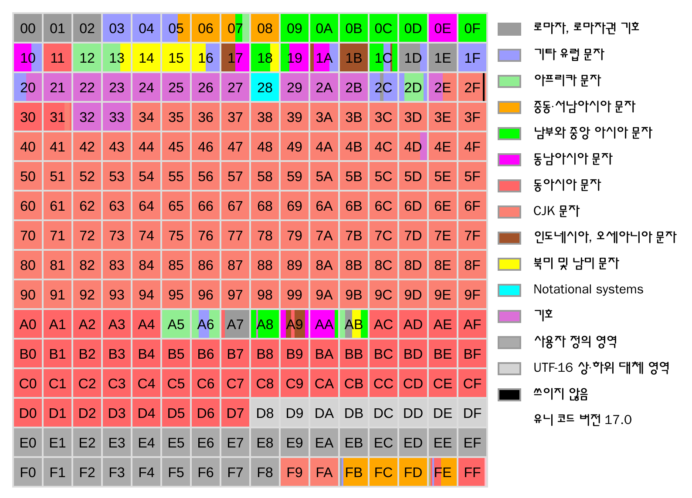

# 유니코드

전 세계의 모든 문자를 디지털 상에서 표현하기 위한 정보 교환 표준 부호

 

**표기방법**  

`U+(16진수 숫자)` 형태로 표기하며,  
한글 "가"는 `U+AC00` 로 표기한다.  
일부 시스템에서는 16진수 표기 관례에 따라 `0xAC00` 로 표현하기도 한다.

 

**유니코드의 범위**  

`U+0000` 에서 `U+10FFFF` 까지 있지만,  
한글을 포함한 다국어는 `U+0000` ~ `U+FFFF` 사이에 모두 정의되어 있다  

 

**유니코드의 구획**

유니코드는 한 구획당 65,536 개의 문자를 포함하며  
총 17개의 구획으로 구성되어있다.

그 중 `U+0000` ~ `U+FFFF` 사이의 범위를 다국어 기본 평면  
(Basic Mutilingual Plane, BMP) 이라고 부르며,  
첫 번째 구획을 담당한다.

 

**BMP 평면**

> 1칸당 256개의 문자가 포함되어있다

 

**한글 유니코드 범위**  
`U+AC00` ~ `U+D7AF` 에 모든 완성형 한글이 포함되어있으며,  **11,172** 자가 할당되어있다

 
 

## 유니코드 스칼라 (Unicode Scalar)

유니코드에서 문자를 표현하기 위한 **21비트 정수 값**을 말한다

 

**범위**
`U+0000` ~ `U+D7FF` 및  
`U+E000` ~ `U+10FFFF`

중간에 영역이 비는데 그 이유는 아래 **서로게이트 영역**에서 설명

 

### 서로게이트[대체] 영역 (Surrogate range)

`UTF-16` 인코딩에서(`UTF-8` 과 `UTF-32` 에서는 필요 X)  
**서로게이트 쌍(Surrogate Pair)** 을 표현하기 위한 예약된 코드 구간,  **이 영역은 스칼라 값에서 제외**됨

쉽게말해서 `U+10000` 너머의 문자를 `UTF-16` 에서 표현하기 위한 유니코드다  

 

**범위**  
`U+D800` ~ `U+DFFF` (2048개)

서로게이트 쌍은 High Surrogate(상위 대리부와) 와 Low Surrogate(하위 대리부) 로 구성되어있다

High Surrogate 의 범위는 `U+D800` ~ `U+DBFF`,  
Low Surrogate 의 범위는 `U+DC00` ~ `U+DFFF` 로 구성되어있다

 

**표현방법**  
`U+0000` ~ `U+FFFF` 까지는 16비트 하나로 표현한다

`U+10000` 부터는 **16비트 2개의 서로게이트 쌍** (즉 32비트) 으로 표현

 

ex) 😀 (U+1F600) 를 UTF-16 으로 표현하는 과정

1. 코드 포인트(code point) 지정  
	codePoint = `0x1F600`
2. `코드 포인트` 에서 `0x10000` 을 뺀뒤, 20비트 이진수로 만들기   	`0000 1111 0110 0000 0000`
3. 20비트를 10비트 씩 분할  
	high10 = `00 0011 1101(0x3D)`,  
	low10 = `10 0000 0000(0x200)`
4. 서로게이트 쌍 계산  
	HIGH = `0xD800` + `0x3D`,
	LOW = `0xDC00` + `0x200`
5. 인코딩 결과  
	`D83D DE00`

 

**그럼 해석할 때는?**

1. `UTF-16` 인코딩 데이터를 프로그램에서 디코딩할 때, 16bit(2byte) 씩 읽는다.

2. 만약 16bit 가 `서로게이트 쌍` 에 해당한다면, 뒤 16bit 를 추가적으로 읽고, 한 문자로 표현한다.

 

**현재는?**

Windows, Java, Android, macOS 에서 내부적으로 문자열을  
UTF-16 기반으로 다루는 경우가 많다

그리고 이모티콘은 `U+10000` 이상에 모두 할당되어있기 때문에  
모바일 환경에서 이모티콘을 사용할 경우, **서로게이트 쌍**으로 저장될 가능성이 매우 높다

 
 

