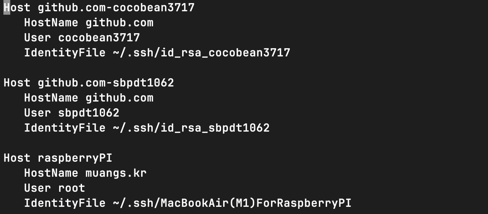
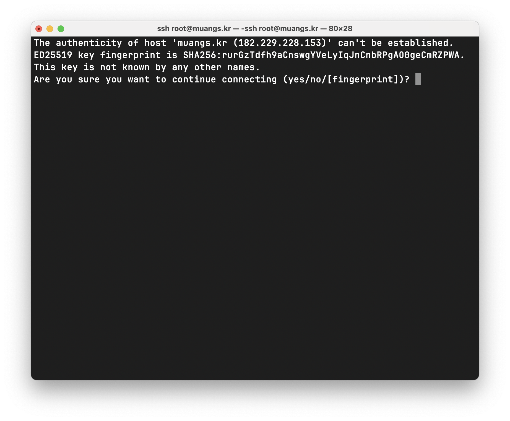
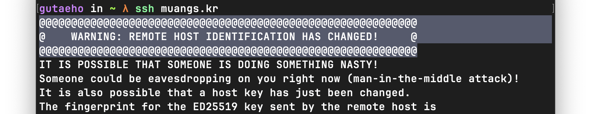

# ssh

ssh 연결 시 발생할 수 있는 문제점 및 해결방안, 관련 정보와 꿀팁

</br>

## ssh 연결하기

컴퓨터에 ssh 클라이언트가 설치되어있다고 가정하고 진행

```bash
# 유저명@도메인(or ip)
ssh user@host # ex) ssh root@muangs.kr
```

</br>

#### tips

ssh 서버는 기본적으로 `root` 계정을 원격접속을 차단하고 있다.  
*(보안을 위해 실제 서비스 중인 환경에서는 별도의 유저를 만들어서 사용하자)*  
~~(현직자 왈 혼난다고 함)~~  

`root` 원격 접속을 위해서 아래 경로에 sshd_config 파일 수정,  
ssh 서비스를 재 실행 해야한다.

```bash
vi /etc/ssh/sshd_config

... 

PermitRootLogin yes # no or yes
```

ssh 서비스 재 실행

```bash
systemctl restart sshd
```


</br>

### 패스워드로 연결하기

#### tips
보안을 위해 키 인증 방식만 채택한경우, 패스워드 로그인이 표시가 안될 수 있다.
해결방법은 다음과 같다

```bash
vi /etc/ssh/sshd_config

... 

PasswordAuthentication yes # no or yes
```

**ssh 서비스 재 실행**

```bash
systemctl restart sshd
```

</br>

### 키로 연결하기 (= 비밀번호 없이 접속)

키 기반 연결은 공개키 기반 암호화 방식을 사용하고 있다.  
먼저 키를 만든 다음 **공개키**를 서버에, **개인키**를 클라이언트에 두면 별도의 로그인 과정없이 연결이 가능하다

1. `ssh-keygen` 을 사용해 키 쌍을 생성한다
    ```bash
    ssh-keygen -t ed25519 -C "testemail@example.com"
    ```
    
    이메일은 단지 식별용이므로 본인이 인식할 수 있는 뭐든 상관없다

2. 생성된 키를 클라이언트와 서버에 각각 넣는다
   
    공개키: 파일명 확장자에 **.pub** 가 붙어있다  
    개인키: 파일명에 아무것도 없다

    </br>

    **클라이언트 측**  
    아래 경로에 **개인키**를 위치시킨다.   
    (키 생성 시점에 이미 해당위치에 있다)

    ```bash
    cd ~/.ssh/
    ```

    **서버 측**  
    아래 파일에 **공개키** 정보를 기입한다
    ```bash
    cd ~/.ssh/authorized_keys
    ```

    추가) 서버 공개키 업로드 명령어  
    ```bash
    # ~/.ssh/id_rsa.pub 로 된 키 전송
    ssh-copy-id user@host

    # 다른 키 보내기
    ssh-copy-id ~/.ssh/
    ```
    

3.  ssh 서비스를 재 실행한다.
    ```bash
    systemctl restart sshd
    ```

</br>

#### tips
클라이언트와 서버측에 키가 모두 설정됐음에도, 비밀번호 입력을 요구할 수 있다.

config 설정

`~/.ssh/config` 파일에 접속할 호스트와 사용될 키를 지정한 뒤 
별칭을 설정해, 별칭으로 접속하면 된다.

**config**



```bash
...

Host raspberryPI        # 별칭
   HostName muangs.kr   # 호스트
   User root            # 유저
   IdentityFile ~/.ssh/MacBookAir(M1)ForRaspberryPI # 개인 키 패스
```

ssh 연결

```bash
ssh raspberryPI
```

</br>

### 연결완료!


</br>
</br>

## known_hosts



**서버 최초 접속 시**

서버에 최초에 ssh 연결 시, 위 처럼 표시가 되며, `yes` 입력 시 서버의 정보를 `known_hosts` 파일에 기록한다.

</br>

### known_hosts?

ssh 원격 접속되었던 서버(호스트) 목록이 기록된 파일

목록에는 각 서버의 **공개키**가 등록되어있다.

**방명록** 과 유사하다고 생각하면 될 듯

</br>

### 용도
SSH 접속할 때 다음과 같은 문구를 본적이 있을 것 이다.

<!-- 사이즈 조정 가능한 이미지 -->



> @@@ WARNING: REMOTE HOST IDENTIFICATION HAS CHANGED! @@@

서버에 접속했을 때, 이전 접속 시 서버의 공개키가 달라지 면 위 경고가 표시되는데, 그 이유는 크게 3가지가 있다

1. 서버의 IP 가 변경되었다
2. 서버의 ssh 공개키가 변경되었다
3. **중간자 공격**이 발생해서 악의적인 공격자가 ssh 통신을 가로챘다

</br>

> 여기서 **중간자 공격** 이란, 클라이언트가 접속할 서버를 도중에
> 가로채, 정보를 몰래 감시하거나, 가로채 조작하는 사이버 공격을 말한다

