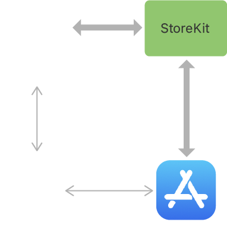

# 인-앱 결제(IAP, In-App Purchase)
별도의 결제망이나 외부 프로그램 없이, 앱 내부에서 상품을 구매하는 방식을 말함


### 가이드 라인
인-앱 결제 가이드 라인에 따르면, 실물 거래가 아닌 디지털 상품 거래 시 

반드시 Storekit 을 통한 결제가 이뤄져야함 그 이외는 허용되지않음. 

다른 방법으로 결제를 유도해서도 안되며, 쿠폰과 같은 대체제를 사용하기 위해서

AppStore 의 프로모션 코드를 사용해야함

<br>

# StoreKit
Apple 플랫폼에서 디지털 상품 및 서비스를 구매할 수 있게 

제공하는 인-앱 결제(In-App Purchase) 프레임워크.

<br>

# Storekit 1 과 Storekit 2
**Storekit1** 은 2009년 iOS 3 이 출시된 이래로 줄곧 사용되어 오다가

WWDC 2021 에서 인-앱 구매를 위한 새로운 API 인 **Storekit2** 를 발표


### 특징
- StoreKit1
    - iOS 3 이상부터 지원
    - Observer, Delegate 패턴을 통한 상품 조회 및 구입, 거래상태 조회 지원
    - **SK** 접두사를 가짐 ex) SKProductsRequest, SKPayment, SKReceiptRefreshRequest 등

- Storekit2
    - iOS 15 이상부터 지원
    - 현대적인 비동기 API (async/await) 지원
    - 더 간결해진 API 사용법(상품 조회 및 구입, 거래 내역 조회 등)
    - 더 직관적인 클래스 명칭 ex) Product, Transaction 등

<br>

애플은 `WWDC 24` 에서 **Storekit1** 을 더 이상 지원하지 않겠다고 발표, 

iOS 18 이후로 `Deprecated` 되었기 때문에 **Storekit2** 를 이용해서 구현.

<br>


## 상품 유형
- 소모성 (Consumable): 여러번 구매 가능한 상품이며 별도의 서버를 통해 구매 항목을 관리 해줘야함
> ex) 보석 한 상자, 코인 x1000
- 비소모성 (Non-consumable): 한 번 구매 후, 영구 지속되는 상품이며 Apple 계정에 귀속됨
> ex) 앱 내 광고 제거, 카메라 필터
- 자동 갱신 구독 (Auto-renewable subscriptions): 구독을 취소하기 전까지 반복적으로 갱신되는 상품
> ex) 왓챠 베이직 구독권
- 비 갱신 구독 (Non-renewing subscriptions): 제한된 기간동안 사용가능하며, 자동 갱신되지 않는 상품

<br>

## Sandbox
앱 내 구매 시 테스트 계정을 사용하여, 비용을 발생시키지 않고 거래를 테스트할 수 있는 환경

<br>

자동 갱신 구독의 경우 갱신 주기가 길기 때문에 테스트가 힘들기 때문에

샌드 박스 환경(Testflight)에서는 기본적으로 자동 갱신 구독 주기가 짧아짐
- 7일 -> 3분
- 한달 -> 5분
- 1년 -> 1시간

### 기능
- 현재 구독중인 상품 표시 및 업그레이드 및 다운그레이드
- 구독 취소
- 구독 갱신 주기 변경
- 구입 및 갱신 허용 토글
- 구입 내역 삭제


### Sandbox 테스트 방법
1. App Store Connect > 사용자 및 액세스 에서 신규 계정 생성
2. 설정 > App Store > 샌드 박스 계정 로그인
3. 앱 내 구입 테스트

<br>


## 구현
Storekit API 는 App Store Connect 에 등록된 제품 ID(ex: com.example.myapp.basic.monthly) 로 상품을 식별

App Store Connect 에 상품을 선행 등록 후, 구현

<br>



<br>

서버를 구현하지않고 앱 자체적으로 구입을 구현하는 경우, 거래 내역을 확인해서 

현재 사용자가 구독 상태인지 확인하는 로직이 추가되어야함

<br>

## 상품 목록 가져오기
**Storekit1**
```swift
class ProductManager: NSObject, SKProductsRequestDelegate {
    var products: [SKProduct] = []
    
    // 매개변수로 AppStoreConnect 에 등록된 제품 ID 배열 전달
    func fetchProducts(productIdentifiers: [String]) {
        let productSet = Set(productIdentifiers)
        let request = SKProductsRequest(productIdentifiers: productSet)
        request.delegate = self
        request.start()
    }
    
    // 요청 성공 시 호출
    func productsRequest(_ request: SKProductsRequest, didReceive response: SKProductsResponse) {
        // 상품 정보 저장
        products = response.products
    }
    
    // 요청 실패 시 호출
    func request(_ request: SKRequest, didFailWithError error: Error) {
        print("Failed to fetch products: \(error.localizedDescription)")
    }
}
```

<br>

**Storekit2**
```swift
class ProductManager: NSObject {
    // 매개변수로 AppStoreConnect 에 등록된 제품 ID 배열 전달
    let products = await Product.products(for: [com.example.myapp.basic.monthly])  // [Product]
}
```

<br>

## 상품 구매하기
**Storekit1**
```swift
class PurchaseManager: NSObject, SKPaymentTransactionObserver {
    override private init() {
        super.init()
         // 거래 상태 관리 옵저버 추가
        SKPaymentQueue.default().add(self)
    }
    
    // 구매 요청
    func purchase(product: SKProduct) {
        if SKPaymentQueue.canMakePayments() {
            let payment = SKPayment(product: product)
            SKPaymentQueue.default().add(payment)
        } else {
            print("결제를 수행할 수 없는 기기 입니다")
        }
    }
    
    // 거래 상태 처리
    func paymentQueue(_ queue: SKPaymentQueue, updatedTransactions transactions: [SKPaymentTransaction]) {
        for transaction in transactions {
            switch transaction.transactionState {
            case .purchased:
                // 구매 성공
                SKPaymentQueue.default().finishTransaction(transaction)
                
            case .failed:
                // 구매 실패
                if let error = transaction.error as NSError?, error.code != SKError.paymentCancelled.rawValue {
                    print("구매 실패 \(error.localizedDescription)")
                } else {
                    print("사용자 취소")
                }
                SKPaymentQueue.default().finishTransaction(transaction)
                
            case .restored:
                // 이전 구매 복원
                SKPaymentQueue.default().finishTransaction(transaction)
                
            case .deferred:
                // 유저 인증 또는 구매 승인 대기 중
                break
                
            case .purchasing:
                // 구매 진행 중
                break
                
            @unknown default: break
            }
        }
    }
    
    // 앱 종료 시 옵저버 제거
    deinit {
        SKPaymentQueue.default().remove(self)
    }
}
```

<br>

**Storekit2**
```swift
class ProductManager {
    // 구매 요청
    func purchase(_ product: Product) async -> Bool {
        guard let result = try? await product.purchase() else {
            return false
        }
            
        switch result {
        case let .success(.verified(transaction)):
            // 성공
            return true
        case let .success(.unverified(_, error)):
            // 구매에 성공했으나, 유효성 인증 실패
            return false
        case .pending:
            // 유저 인증 또는 구매 승인 대기 중
            return false
        case .userCancelled:
            // 사용자 취소
            return false
        @unknown default:
            // 기타
            return false
        }
    }
}
```

<br>

## 거래 내역 조회
**Storekit1**
```swift
class TransactionManager: NSObject, SKPaymentTransactionObserver {
    static let shared = TransactionManager()
    
    override private init() {
        super.init()
        SKPaymentQueue.default().add(self)
    }
    
    // 거래 내역 요청
    func restorePurchases() {
        SKPaymentQueue.default().restoreCompletedTransactions()
    }
    
    // 거래 상태 처리
    func paymentQueue(_ queue: SKPaymentQueue, updatedTransactions transactions: [SKPaymentTransaction]) {
        for transaction in transactions {
            switch transaction.transactionState {
            case .restored:
                SKPaymentQueue.default().finishTransaction(transaction)
                // 거래 내역 복원 처리
            default:
                break
            }
        }
    }
    
    // 복원 완료 시 호출
    func paymentQueueRestoreCompletedTransactionsFinished(_ queue: SKPaymentQueue) {
        print("거래 내역 복원됨")
    }
    
    // 복원 중 오류 발생 시 호출
    func paymentQueue(_ queue: SKPaymentQueue, restoreCompletedTransactionsFailedWithError error: Error) {
        print("거래 내역 복원 실패: \(error.localizedDescription)")
    }
    
    // 앱 종료 시 옵저버 제거
    deinit {
        SKPaymentQueue.default().remove(self)
    }
}
```

<br>

**Storekit2**
```swift
class ProductManager {
    func restorePurchases() async {
        for await result in Transaction.currentEntitlements {
            guard case .verified(let transaction) = result else {
                // 검증되지 않은 거래
                continue
            }
            
            if transaction.revocationDate == nil {
                // 현재 활성화된 거래
            } else {
                // 만료된 거래
            }
        }
    }
}
```

<br>

## 주의 사항
1. 구독 그룹의 그룹핑
2. 상품 식별자 삭제 후 복구
3. 구독 만료 후 재 구독 시
**Storekit2**
```swift
// 앱 실행 후 거래 상태 변경 발생 시 거래를 종료하는 작업 수행

class ProductManager {
    /// 거래 종료 처리
    func startObserveTrasaction() {
        Task {
            for await result in Transaction.updates {
                switch result {
                case .verified(let transaction):
                    await transaction.finish()
                case .unverified(let transaction, _):
                    await transaction.finish()
                }
            }
        }
    }
}
```