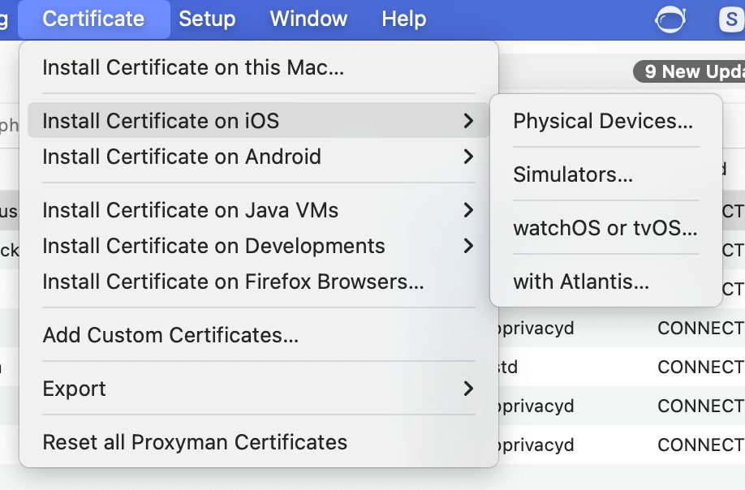

# Proxy & Proxyman

## Proxy?

클라이언트 & 서버 구조에서 중간에 위치하여, 둘 사이를 중계하는 서버(서비스)  
> ex) 클라이언트 <-> 프록시 <-> 서버

</br>

프록시는 크게 `Forward Proxy` 와 `Reverse Proxy` 두 종류가 있다

</br>

### Forward Proxy

클라이언트의 요청을 대신해서 서버로 전달하고 받은 응답을 클라이언트로 돌려준다

#### 사용이유

1. 접근제어: 내부망 클라이언트가 외부망 접근 시 특정 도메인을 접근할 수 없게 차단
2. 익명성: 클라이언트 IP 를 숨기고 프록시 IP 로 서버에 접근 가능
3. 부하감소: 이미 요청된 페이지를 캐싱해 서버 부하를 줄일 수 있다

</br>

### Reverse Proxy

클라이언트의 요청을 받는 것은 동일하지만, 어떠한 서버로 전달할지 프록시가 정하며, 응답 결과를 클라이언트로 돌려준다

#### 사용이유

1. 익명성: 서버 IP 를 숨기고 프록시 IP 로만 서버에 접근 가능
2. 부하분산: 부하가 집중된 서버대신 한가한 서버로 클라이언트 요청 전달

</br>

### Proxyman

iOS 앱과 서버간의 통신을 구현할 때, 디버깅 & 모니터링을 위해 HTTP Header 와 body 를 보려면 
앱에서 요청 및 응답을 가로채 표시하는 기능을 별도로 추가해야하며, 이 과정은 번거롭고 많은 시간이 소요된다.

`Proxyman` 은 동일 네트워크상에 있는 iOS 기기와 서버 사이에 위치해,
서로가 주고받는 정보를 실시간으로 확인할 수 있는 `Forward Proxy` 도구다.

</br>

### Proxyman 원리

1. 동일 라우터 아래에 연결된 iOS 기기와 macOS 기기 존재

2. 기존 iOS 기기와 라우터간 통신을 가로채기 위해, iOS 기기에서 지원하는 
HTTP 프록시 구성을 수동으로 사용

3. 프록시 설정을 macOS 의 IP 와 포트로 설정

여기까지 진행한경우, 서버의 IP 주소와 포트, 도메인 정보는 표시되지만
HTTPS 통신 특성상, 더 자세한 정보는 TLS 암호화 되어있어서 볼 수 없다.

`Proxyman` 은 암호화된 정보를 복호화하기 위해 가짜 인증서를 발급하고 iOS 기기에 설치 및 신뢰하는 과정을 거치게 하는데,
이 과정을 통해 `Proxyman` 이 발급한 인증서는 공인된 인증서(사설 Root 인증서)가 되어 기기에서  
발생하는 모든 요청 및 응답을 암 & 복호화 할 수 있게 된다.

</br>

### Proxyman 설치 및 설정 방법

1. brew 로 proxyman 설치
```bash
brew install --cask proxyman
```
2. proxyman > Certificate > install certificate on iOS > Physical Devices



</br>

3. iOS Setup Guide 따라하기  
	a. install Root Certificate 클릭 및 macOS 에 인증서 설치  
	b. iOS 기기 > 설정 > WI-FI > 현재 접속된 WI-FI > 프록시 구성 > 수동 > 서버와 포트를 복사해 붙여넣기


</br>


</br>


</br>

4. 사파리에서 "http://cert.proxyman.io" 또는 "http://proxy.man/ssl" 연결해 프로파일 다운로드
5. 인증서 다운로드 얼럿이 표시되지않을 경우, 맥 설정 > 네트워크 > 방화벽 > Proxyman.app 추가 및 들어오는 연결 허용
6. 다시 사파리 접속 및 프로파일 내려받기
7. iOS 기기 > 설정 > 프로필이 다운로드됨 > 설치
8. 설정 > 일반 > 정보 > 인증서 신뢰 설정 > 인증서 활성화

</br>

