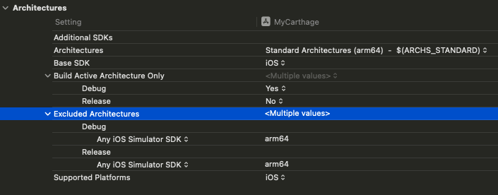

# Xcode의 시뮬레이터 빌드 문제

### 원인
Xcode12 에서 ARM기반 맥을 지원함에 따라 아이폰 시뮬레이터에도 ARM 아키텍쳐(`arm64`)가 추가되어 발생

### 해결 방법
Xcode > Build Setting 에

1. `Excluded Architectures` 에 `arm64` 를 추가
2. Xcode 12 이전에 생성된 프로젝트일 경우 `VALID_ARCHS` 제거 (Xcode 14 부터 deprecated)

### 상세 분석
> 맥에서 동작하는 시뮬레이터는 맥 CPU의 아키텍쳐를 따라간다.

 
Xcode 12 부터 구형 맥 (x86_64) 과 신형 맥 (arm64) 환경의 시뮬레이터를 모두 지원하기 위해 `x86_64` 와 `arm64` 두 종류의 시뮬레이터를 제공하는데,
기존에는 `x86_64` 로 시뮬레이터를 빌드하며 문제가 없었지만, `arm64` 환경이 추가되며 둘 중 어느 환경으로 빌드해야할지 선택을 하지않아서 발생.

 

### 빌드 최적화
- 사용하는 맥이 `arm64(apple silicon)`를 사용할 경우, 시뮬레이터 빌드 최적화를 위해 `x86_64` 를 제외할 수 있다.
- `arm64` 아키텍쳐를 사용하는 기기만 빌드하는 경우, 32비트 기반의 `armv7` 를 빌드할 필요가 없다. **ONLY_ACTIVE_ARCH (Build Active Architecture Only) 옵션**은 기기에 맞는 바이너리만 생성한다.

# 프레임워크 문제
`맥 아키텍쳐와 시뮬레이터의 아키텍쳐를 서로 일치되게 맞췄음에도 시뮬레이터 오류가 나는 경우`
### 원인
> 프레임워크가 지원하는 아키텍쳐 목록을 확인하려면 `lipo -info <framework name>` 명령을 사용할 수 있다.

애플 실리콘이 등장하기 전에 만들어진 프레임워크 중 일부가 `arm64` 를 지원하지 않아서 발생함.

### 해결 방법
일부 또는 모든 프레임워크를 `x86_64` 로 빌드하고, 시뮬레이터를 **로제타**로 돌리면 정상적으로 실행된다.

### 키워드
`Architecture` - 컴퓨터의 연산을 담당하는 중앙처리장치가 사용하는 명령어 집합(ISA)을 정의하는 방식, 명령어 집합과 아키텍쳐는 약간의 차이는 있지만 아키텍쳐와 명령어 집합은 1:1 관계이므로 동의어로 취급함.

`lipo -info` - 프레임워크가 지원하는 아키텍쳐 리스트를 표시합니다.

### 참고
- https://jusung.github.io/Xcode12-Build-Error/
- https://ios-development.tistory.com/1212 (Build Setting 개념)
- https://frozenrainyoo.tistory.com/5 (lipo 명령어)
- https://hanru-yeh.medium.com/xcode-error-building-for-ios-simulator-because-of-architecture-arm64-349bf5065437 (시뮬레이터 빌드 에러)
- https://yurimac.tistory.com/74 (armv7, arm64)